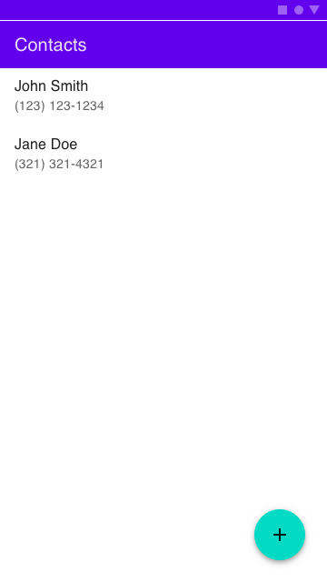

# Background

This exercise is intended to allow you to demonstrate your design and coding abilities working on a problem that is similar to the kinds of challenges we address every day. While the scope of this exercise is tiny, it will touch on many of the topics we look forward to discussing with you - Android and cross-platform development, threading, asynchronous calls, memory management, etc. At the end of the exercise, we look forward to a working piece of code and an informed discussion about your API, design choices, testing strategy, etc.

# Logistics

This exercise is designed to fit in your schedule and can be done asynchronously at any time. You can perform it on your own hardware and use any tools you would normally use in day-to-day development. You are free to use, and in fact are encouraged to use, third-party libraries (no need to write your own JSON parser).

This is a take-home exercise so you can perform it on your own terms. However, your solution must be submitted within 7 days. The exercise should not take more than two days elapsed time, taking into account that there are other things going on in our lives. So think one or two weeknights or perhaps a weekend day. We will be available to help via email while you’re working on your exercise and are very much looking forward to what you’ll build!

# The Challenge

The challenge we are going to address with this exercise is to write a minimalistic implementation of a cross-platform mobile SDK to manage “Twilio Contacts”. Imagine, if you will, that we have written a cloud-based distributed system to manage phone contacts - first name, last name, and phone number - and we want to write mobile client libraries to access those contacts in a cross-platform way. So, on the client-side, we’re going to have a common C++ library that will be used by both the iOS and Android SDKs. However, this exercise is scoped to the Android platform. Specifically, your solution should contain the following components:

1. C++ Contacts SDK
2. Android Contacts SDK - This SDK should use your C++ SDK
3. Sample Android application that demonstrates the SDK capabilities. The end-users of our hypothetical SDK - developers - will use the SDK to build simple UIs like this:



We have created a starter project that you can download [here](). This project provides starter code to implement the Twilio Android SDK Coding challenge. The project provides an app and library module with basic functionality where you can implement a solution to the provided coding challenge. The project includes getting started instructions, but getting started should be as easy as importing the project into the latest stable version of Android Studio.

# Part 1 - APIs

In order to keep the exercise short we will completely abstract away the server-side of things - we will just pretend that the servers are there and simulate all the events and responses.

We will also keep the API extremely simple. All it has to do is:

1. List contacts - return a list of known contacts
2. Add a contact - accept the data and asynchronously notify the caller of success/failure
3. Trigger update events - notify the application that a contact has been updated

For this part, you’ll have to design the API signatures for C++ and Android (Kotlin). For example, the Kotlin API may look something like this:

```kotlin
data class Contact(val firstName: String, val lastName: String, val phoneNumber: String)
```

```kotlin
class Contacts {
    interface Listener {
        fun onContactAdded(contact: Contact)
        fun onContactUpdated(oldContact: Contact, newContact: Contact)
    }

    fun addContact(contact: Contact, contactListener: Contacts.Listener) {}
}
```

Document your API contract in header files appropriate for each platform.

# Part 2 - C++ Implementation

For the next part, you’ll have to build a simple implementation of the C++ API. You can use the JSON list in the contacts.cpp file of your starter kit to seed your contacts list. You do not have to make any server-side calls. Simply maintain your list of contacts in memory and return it when queried. Add or update contacts in your list as necessary and make the appropriate callbacks. For bonus points, simulate (generate) a contact-updated event (as if one has arrived from the server) at random intervals.

The output of this part will be a C++ library with headers that you will use in the next part.

# Part 3 - Android Implementation

Now that you have a C++ library and headers, let’s wrap it and expose it in Kotlin. Write a quick Kotlin wrapper that implements the API you defined in Part 1 and marshals the calls down through JNI to the C++ library you implemented in Part 2. This layer may not do much, but it’s important that we go from Kotlin code down to C++ and back up.

Write tests that validate your work. The tests should exercise the API you defined in Part 1 and show that the expected behavior is implemented.

# Part 4 - Sample App

Now that you have the Android wrappers are complete, implement a simple app that demonstrates the use of the Contacts SDK. All it has to do is demonstrate the use of the SDK - list the available contacts, allow a new one to be created, and reflect any updates received.

Here’s a simple Android implementation that would do the trick:


# Wrap Up

Congratulations! You’ve finished the challenge. You have a working set of code. Please upload your solution as a tar.bz2 or zip file. In either case, make sure to include some notes on what you’ve done, why you’ve made the choices you’ve made, and any other items we should know. For example - how to build your code, how to run it, and what are the known issues.

We will review your work and will get back to you in a few days.

Looking forward to what you’ll build!